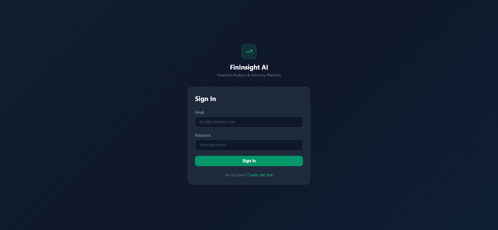
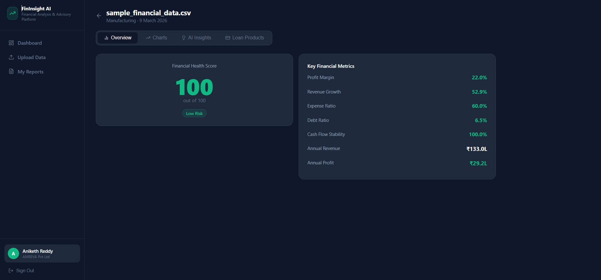
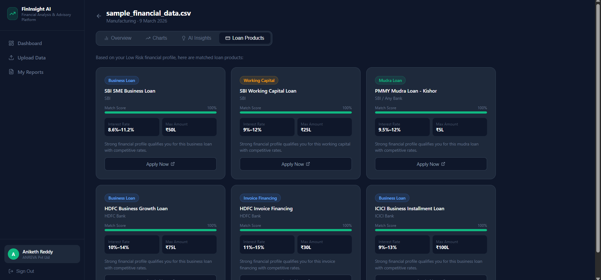

# FinInsight AI

## AI-Powered Financial Analysis and Advisory Platform

FinInsight AI is a **full-stack web application** designed to analyze financial data and provide intelligent advisory insights for businesses. The platform allows users to upload financial datasets, visualize financial metrics, and receive AI-based recommendations such as loan products suitable for their financial profile.

This project was developed as a **B.Tech Computer Science Final Year Major Project**.

---

# 🚀 Features

* 🔐 User Authentication (Login / Signup)
* 📊 Financial Data Upload and Processing
* 📈 Financial Metrics Dashboard
* 📉 Interactive Data Visualization
* 🤖 AI-Based Financial Insights
* 💰 Loan Product Recommendations
* 📁 Financial Report Generation

---

# 🏗 System Architecture

Frontend → Backend → Financial Analysis Engine → Database

```
React Frontend (Port 3000)
        │
        ▼
Python Backend (FastAPI)
        │
        ▼
Financial Analysis Engine
        │
        ▼
SQLite Database
```

---

# 💻 Tech Stack

### Frontend

* React.js
* HTML5
* CSS3
* JavaScript

### Backend

* Python
* FastAPI

### Data Processing

* Pandas
* NumPy

### Database

* SQLite

### Tools

* Git
* GitHub

---

# 📂 Project Structure

```
major_project
│
├── backend
│   ├── main.py
│   ├── requirements.txt
│   └── financial_health.db
│
├── frontend
│   ├── src
│   ├── public
│   └── package.json
│
├── screenshots
│   ├── login.png
│   ├── dashboard.png
│   └── loan_products.png
│
├── README.md
└── .gitignore
```

---

# ⚙️ Installation & Setup

## 1️⃣ Clone the Repository

```
git clone https://github.com/yourusername/FinInsight-AI.git
cd FinInsight-AI
```

---

## 2️⃣ Backend Setup

Navigate to backend folder:

```
cd backend
```

Install required Python packages:

```
pip install -r requirements.txt
```

Start backend server:

```
uvicorn main:app --reload --port 8000
```

Backend will run on:

```
http://localhost:8000
```

---

## 3️⃣ Frontend Setup

Open another terminal and navigate to frontend folder:

```
cd frontend
```

Install dependencies:

```
npm install
```

Start the frontend server:

```
npm start
```

Frontend will run on:

```
http://localhost:3000
```

---

# ▶️ Running the Application

1. Start the backend server
2. Start the frontend server
3. Open your browser and go to:

```
http://localhost:3000
```

---

# 📸 Application Screenshots

### 🔐 Login Page



---

### 📊 Financial Analysis Dashboard



---

### 💰 Loan Recommendation System



---

# 🎯 Use Cases

* Business financial performance analysis
* Financial advisory for SMEs
* Loan eligibility insights
* Educational financial analytics platform

---

# 🎓 Academic Details

Project Title:
**AI-Powered Financial Analysis and Advisory Platform**

Project Type:
B.Tech Final Year Major Project

---

# 📄 License

This project is developed for **academic and educational purposes**.
